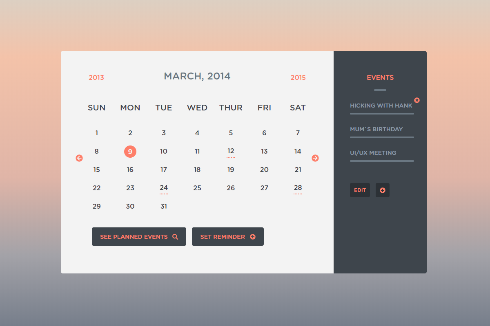

 

# Freebie Calendar Template

HTML5/CSS3 calendar template based on Peter Filan`s free [design](http://www.peterfinlan.com/freebies/calendarUI.psd).

# How can you use this project?
- As learning [BEM](https://en.bem.info/) methodology.
- As a reference for starting your own layout using Gulp + SCSS.
- As a template for creating your own calendar component. 

# Demo
You can follow [the link](https://anton-marchenko.github.io/am.freebie-calendar-template/) for watching a demo.

# Browser support
For latest versions of:
- Chrome
- Opera
- Firefox
- Edge
- Yandex.Browser

# Development
- Install Gulp globally with `npm i gulp -g`
- Clone the project and run `npm i` to install packages.
- Run application with `npm start` (this command runs a server on a port 3000 and uses BrowserSync for hot reloading).

# W3C validation

This project validates as [HTML5](https://html5.validator.nu/?doc=https%3A%2F%2Fanton-marchenko.github.io%2Fam.freebie-calendar-template%2F) and [CSS3](https://jigsaw.w3.org/css-validator/validator?uri=https%3A%2F%2Fanton-marchenko.github.io%2Fam.freebie-calendar-template%2F&profile=css3svg&usermedium=all&warning=1&vextwarning=&lang=en).